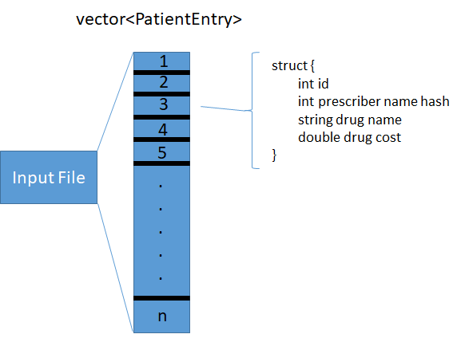
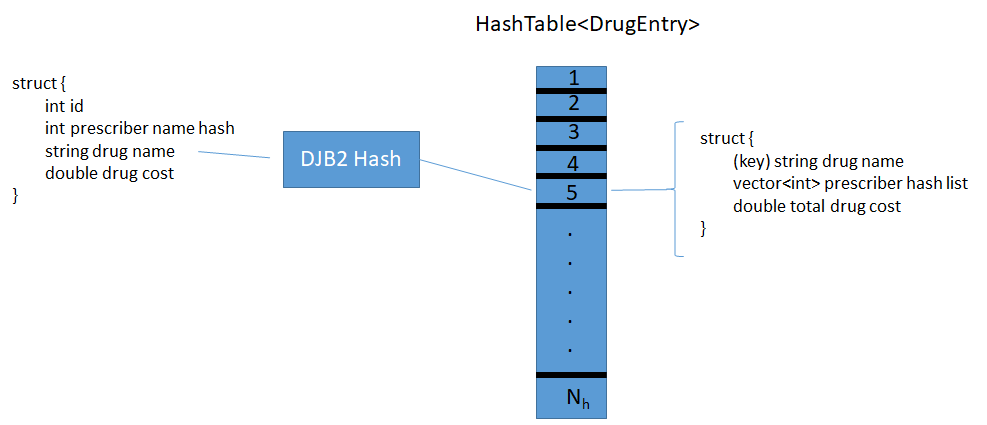

# Insight Coding Challenge
Submission for Insight Data Engineering Pharmacy Counting Coding Challenge

Coder: Zachary Sun

# Table of Contents
1. [Problem](README.md#problem)
2. [Input Dataset](README.md#input-dataset)
3. [Output](README.md#output)
4. [How to Compile and Run the Program](README.md#how-to-compile-and-run-the-program)
5. [Individual Folder Breakdown](README.md#individual-folder-breakdown)
6. [Overview of Methodology](README.md#overview-of-methodology)


# Problem

Imagine you are a data engineer working for an online pharmacy. You are asked to generate a list of all drugs, the total number of UNIQUE individuals who prescribed the medication, and the total drug cost, which must be listed in descending order based on the total drug cost and if there is a tie, drug name. 

# Input Dataset

The original dataset was obtained from the Centers for Medicare & Medicaid Services but has been cleaned and simplified to match the scope of the coding challenge. It provides information on prescription drugs prescribed by individual physicians and other health care providers. The dataset identifies prescribers by their ID, last name, and first name.  It also describes the specific prescriptions that were dispensed at their direction, listed by drug name and the cost of the medication. 

# Output 

The program creates a comma seperated output text file specified by a second input parameter.

Each line of this file contains these fields:
* drug_name: the exact drug name as shown in the input dataset
* num_prescriber: the number of unique prescribers who prescribed the drug. For the purposes of this challenge, a prescriber is considered the same person if two lines share the same prescriber first and last names
* total_cost: total cost of the drug across all prescribers

For example

If the input data, **`itcont.txt`**, is
```
id,prescriber_last_name,prescriber_first_name,drug_name,drug_cost
1000000001,Smith,James,AMBIEN,100
1000000002,Garcia,Maria,AMBIEN,200
1000000003,Johnson,James,CHLORPROMAZINE,1000
1000000004,Rodriguez,Maria,CHLORPROMAZINE,2000
1000000005,Smith,David,BENZTROPINE MESYLATE,1500
```

then the output file, **`top_cost_drug.txt`**, would contain the following lines
```
drug_name,num_prescriber,total_cost
CHLORPROMAZINE,2,3000
BENZTROPINE MESYLATE,1,1500
AMBIEN,2,300
```

These files are provided in the `insight_testsuite/tests/test_1/input` and `insight_testsuite/tests/test_1/output` folders, respectively.

[top](README.md#insight-coding-challenge)


# How to Compile and Run the Program

A seperate compile script (**`compile.sh`**) has been given to strictly compile without running the program. **`run.sh`** will still compile the program and run the basic test input/output file combination (**`itcont.txt`** and **`top_cost_drug.txt`**).

For different inputs use the following command syntax:
`bin/pharmacy_counter input_file output_file`

[top](README.md#insight-coding-challenge)


# Individual Folder Breakdown
**`src`**: src folder with source files, see [README](src/README.md) for descriptions of each source file

**`bin`**: Folder for binary files copied after compilation by **`compile.sh`** and **`run.sh`**

**`input`**: Folder to keep input pharmacy data. Included is the provided test input file **`itcont.txt`**.

**`output`**: Folder to keep output drug data. My run results for the provided **`itcont.txt`** (**`top_cost_drug.txt`**) as well as the 24 million record data set provided <a href="https://drive.google.com/file/d/1fxtTLR_Z5fTO-Y91BnKOQd6J0VC9gPO3/view?usp=sharing">here</a> (**`de_cc_drug_cost.txt`**).

**`insight_testsuit`**: This was the provided test folder with a test script to verify the correctness of the file structure and to test run the program on the **`itcont.txt`** dataset. For completeness I have also provided the file I generated with Microsoft Excel as my truth file for the 24 million record dataset (**`de_cc_drug_cost.txt`**).

[top](README.md#insight-coding-challenge)


# Overview of Methodology
Each row of the input file is captured into a struct (`PatientEntry`) which is then collected in a vector. To save on space the prescribers' name was concatenated together (last name + first name) and then hashed with the DJB2 hash function in **`util.h`**. The description provided of the input data states that a prescriber is identified by id, last name, and first name. However, the stated desire for output was that lines with the same first and last name were considered the same person. As a result the id field is insufficient to determine uniqueness as based on subset inspection there were entries with identical names but different ids, and thus the full name is neededed to determine uniqueness.



It should be noted as with any hash approach this has potential for collision but for the scope of this project I assume the risks are low enough and make note that an alternative approach would be to assign each prescriber a unique id through a hash lookup method that handles collisions and store that id instead. The space issue has higher ramifications as part of the uniqueness criteria. The collision impact experimentally looks to be very low. On the 24 million record data set only 327 prescribers were not counted due to collision. Of the 2,749 drugs prescribed in the dataset, 151 of them had an incorrect unique prescriber count due to collisions. For any given drug, the highest error rate that it ever grew to was 0.016% with 1 missing prescriber out of a total of 6,115. The largest number of missing prescriber count for a given drug was 11 out of a total of 274,312 prescribers.

Once the file is read it processes each entry by using a modular hash of the drug name to retrieve a `DrugEntry` structure that contains all the information necessary for one row of the ouptut file.


If none exists then a fresh one is used (meaning this is a "new" drug). A list of hashed prescriber names are maintained for each drug to ensure an accurate count of unique prescribers. In addition it then accumulates the drug cost.

As part of this process it also maintains an unsorted list of drug names. We do a quicksort in descending order of the total cost of each drug (then by drug name if tied) by using the drug names to do a modular hash lookup. This ordered list and the corresponding information is then written out to the output file.

[top](README.md#insight-coding-challenge)
